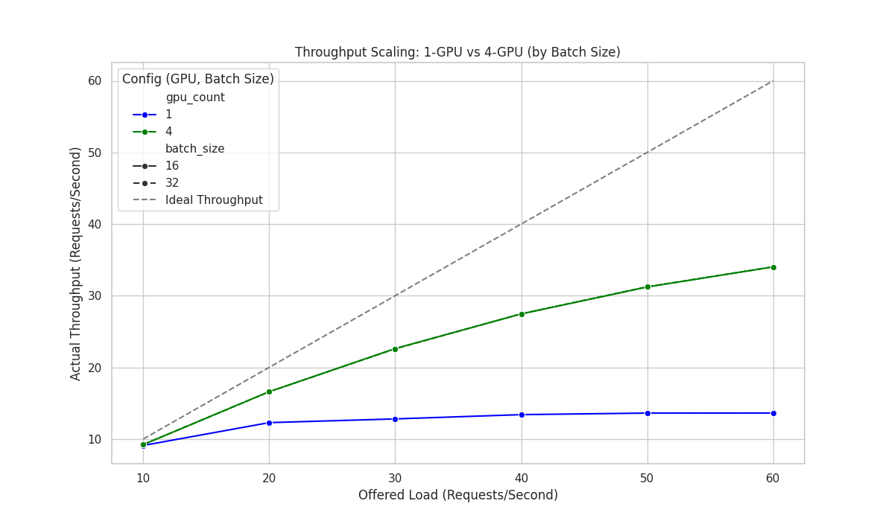

# vLLM Performance and Scalability Analysis Report

[한국어 README](README_kr.md)

This project is designed to examine the performance characteristics of the vLLM inference server, with a particular focus on systematically measuring and analyzing throughput scalability in multi-GPU environments using Data Parallelism.

## 1. Executive Summary

**Data Parallelism in vLLM is highly effective under heavy workloads.**

When scaling from 1 GPU to 4 GPUs, the system’s **maximum throughput improved by approximately 2.5x (13.7 req/s → 34+ req/s)** while maintaining very low and stable latency, even under high load.

This demonstrates that simply adding more GPUs can significantly improve vLLM’s concurrent serving capacity. However, **a key prerequisite for observing these scalability benefits is applying enough load to exceed the capacity of a single GPU.**

## 2. Experiment Overview

This report documents the experimental process conducted to answer two key questions:

1. **Saturation Point Analysis:** How much load can a single-GPU vLLM server handle before reaching its limits?
2. **Scalability Analysis:** How much does throughput improve, and how does latency behave, when scaling from 1 GPU to 4 GPUs?

### 2.1. Project Structure

```
vllm_load_test/
├── README.md                   # This document
├── docker-compose.yml          # Docker setup for vLLM server
├── requirements.txt            # Project dependencies
│
├── config/                     # Experiment configurations
│   ├── experiment_matrix.yaml    # Initial low-load (10 req/s) performance test
│   ├── saturation_matrix.yaml    # 1-GPU saturation point test
│   └── scaling_matrix.yaml       # 1-GPU vs 4-GPU scalability test
│
├── scripts/                    # Automation for experiments and data processing
│   ├── 1_run_matrix.py           # (Reference) Initial low-load test
│   ├── 2_run_saturation_test.py  # [Exp 1] Saturation point test
│   ├── 3_run_scaling_test.py     # [Exp 2] Scalability test
│   ├── run_single.sh             # Invoked by `1_run_matrix.py`
│   ├── run_single_saturation.sh  # Invoked by `2_run_saturation_test.py`
│   ├── run_single_scaling.sh     # Invoked by `3_run_scaling_test.py`
│   └── aggregate_metrics.py      # Summarizes raw result data
│
├── results/                    # Experiment outputs
│   ├── raw/                      # Detailed logs, monitoring data, JSON results
│   ├── agg/                      # Aggregated summary data (parquet)
│   └── figs/                     # Charts generated during analysis
│
└── analysis/                   # In-depth analysis using Jupyter notebooks
    ├── 1_notebook.ipynb          # Initial low-load experiment analysis
    ├── 2_saturation_analysis.ipynb   # Saturation point analysis
    └── 3_scaling_analysis.ipynb      # Scalability comparison
```

### 2.2. Execution and Analysis Workflow

**1. Install dependencies**

```bash
pip install -r requirements.txt
```

**2. Launch vLLM server**

Start the vLLM server using Docker Compose with the configuration defined in `docker-compose.yml`:

```bash
docker compose up -d
```

**3. Run experiments**

Run the appropriate Python scripts for each experiment:

```bash
# [Experiment 1] 1-GPU saturation point test
python scripts/2_run_saturation_test.py

# [Experiment 2] 1-GPU vs 4-GPU scalability test
python scripts/3_run_scaling_test.py

# (Reference) Initial low-load test
python scripts/1_run_matrix.py
```

**4. Aggregate and analyze results**

After experiments complete, aggregate raw data from `results/raw/` and run analysis notebooks.

```bash
# Aggregate results (common to all experiments)
python scripts/aggregate_metrics.py

# Launch Jupyter Notebook
jupyter notebook
```

You can then open the notebooks in the `analysis/` folder to perform detailed analysis.

---

## 3. Results and Analysis

### 3.1. Experiment 1: Single-GPU Saturation Point Analysis

* **Analysis Notebook:** `analysis/2_saturation_analysis.ipynb`
* **Objective:** Identify the maximum load a single GPU server can sustain.
* **Method:** Fixed at 1 GPU, gradually increased request rate from 10 to 60 req/s, measuring throughput and latency.

**Results:**


* **Throughput (blue line):** As offered load reached 20 req/s, actual throughput plateaued at **\~13.7 req/s**, indicating a clear **performance ceiling.**
* **Latency (red line):** Starting from \~20 req/s, time-to-first-token (TTFT) skyrocketed from 87ms to 6,900ms (\~80x increase), reflecting severe queuing delays.

**Conclusion:** A single-GPU system caps out at \~13.7 req/s. Beyond this, the system saturates and latency increases exponentially.

### 3.2. Experiment 2: Multi-GPU Scalability Analysis

* **Analysis Notebook:** `analysis/3_scaling_analysis.ipynb`
* **Objective:** Measure performance gains when scaling from 1 GPU to 4 GPUs under loads exceeding the 1-GPU limit.
* **Method:** Compared 1-GPU and 4-GPU systems under request rates from 10 to 60 req/s.

**Results:**

#### Throughput Comparison



* **1-GPU (blue line):** Plateaued at \~13.7 req/s.
* **4-GPU (green line):** Continued scaling, reaching **34 req/s at 60 req/s load**, \~2.5x higher than 1-GPU. No clear saturation observed at this load.

#### Latency Comparison


* **TTFT (left chart):**

  * 1-GPU showed latency spikes into the thousands of ms beyond 20 req/s.
  * **4-GPU maintained \~120ms TTFT even at 60 req/s,** demonstrating efficient queue management.
* **TPOT (right chart):**

  * Per-token generation latency also remained lower and more stable in 4-GPU compared to 1-GPU.

**Conclusion:** vLLM’s Data Parallelism works effectively. Scaling to 4 GPUs significantly increased throughput and maintained consistently low latency under heavy workloads, offering excellent scalability and responsiveness.
