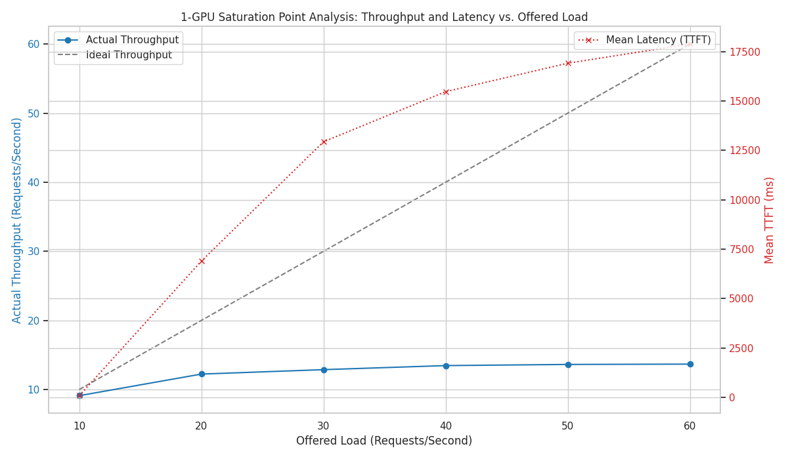
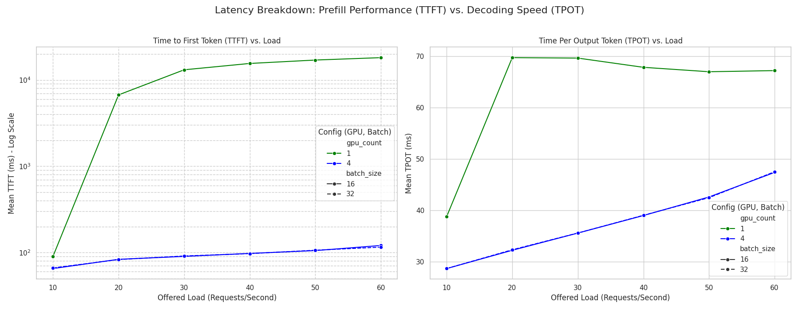

# vLLM 성능 및 확장성 분석 리포트

이 프로젝트는 vLLM(vLLM) 추론 서버의 성능 특성을 파악하고, 특히 Data Parallelism을 이용한 다중 GPU 환경에서의 처리량(Throughput) 확장성을 체계적으로 측정하고 분석하기 위해 설계되었습니다.

## 1. 최종 결론 (Executive Summary)

**vLLM의 Data Parallelism은 높은 부하 상황에서 매우 효과적입니다.**

GPU를 1개에서 4개로 늘렸을 때, 시스템의 **최대 처리량(Max Throughput)은 약 2.5배 (13.7 req/s → 34+ req/s) 향상**되었으며, 높은 부하에서도 응답 시간(Latency)을 매우 낮고 안정적으로 유지했습니다.

이는 단순히 GPU를 추가하는 것만으로도 vLLM 서버의 동시 사용자 처리 능력을 크게 향상시킬 수 있음을 의미합니다. 단, 이러한 확장성의 이점을 확인하기 위해서는 **단일 GPU의 처리 용량을 넘어서는 충분한 부하를 가하는 것이 핵심 전제**입니다.

## 2. 실험 개요

본 리포트는 다음 두 가지 핵심 질문에 답하기 위한 실험 과정을 담고 있습니다.

1.  **포화 지점(Saturation Point) 분석:** 단일 GPU vLLM 서버는 어느 정도의 부하까지 안정적으로 처리할 수 있는가?
2.  **확장성(Scalability) 분석:** GPU를 4개로 늘렸을 때, 처리량은 얼마나 향상되며 응답 시간은 어떻게 변화하는가?

### 2.1. 프로젝트 구조

```
vllm_load_test/
├── README.md                   # 본 문서
├── docker-compose.yml          # vLLM 서버 실행을 위한 Docker 설정
├── requirements.txt            # 프로젝트 의존성
│
├── config/                     # 모든 실험 설정을 관리
│   ├── experiment_matrix.yaml    # 초기 저부하(10 req/s) 성능 측정용
│   ├── saturation_matrix.yaml    # 1-GPU 포화 지점 테스트용
│   └── scaling_matrix.yaml       # 1-GPU vs 4-GPU 확장성 테스트용
│
├── scripts/                    # 실험 실행 및 데이터 처리 자동화
│   ├── 1_run_matrix.py           # (참고) 초기 저부하 테스트 실행
│   ├── 2_run_saturation_test.py  # [실험 1] 포화 지점 테스트 실행
│   ├── 3_run_scaling_test.py     # [실험 2] 확장성 테스트 실행
│   ├── run_single.sh             # `1_run_matrix.py`가 호출
│   ├── run_single_saturation.sh  # `2_run_saturation_test.py`가 호출
│   ├── run_single_scaling.sh     # `3_run_scaling_test.py`가 호출
│   └── aggregate_metrics.py      # 원본(raw) 결과 데이터를 요약/집계
│
├── results/                    # 모든 실험 결과물
│   ├── raw/                      # 각 실험의 상세 로그, 모니터링 데이터, JSON 결과
│   ├── agg/                      # 집계된 요약 데이터 (parquet)
│   └── figs/                     # 분석 노트북에서 생성된 차트 이미지
│
└── analysis/                   # Jupyter 노트북을 이용한 심층 분석
    ├── 1_notebook.ipynb          # 초기 저부하 실험 분석
    ├── 2_saturation_analysis.ipynb   # 포화 지점 분석
    └── 3_scaling_analysis.ipynb      # 확장성 비교 분석
```

### 2.2. 실행 및 분석 방법

**1. 의존성 설치**
```bash
pip install -r requirements.txt
```

**2. vLLM 서버 실행**

docker compose를 이용하여 vLLM 서버를 실행합니다. 이때, `docker-compose.yml` 파일에 정의된 설정을 사용합니다.

```bash
docker compose up -d
```

**3. 실험 실행**

각 실험 목적에 맞는 Python 스크립트를 실행합니다.

```bash
# [실험 1] 1-GPU 포화 지점 테스트 실행
python scripts/2_run_saturation_test.py

# [실험 2] 1-GPU vs 4-GPU 확장성 테스트 실행
python scripts/3_run_scaling_test.py

# (참고) 초기 저부하 테스트 실행
python scripts/1_run_matrix.py
```

**4. 결과 집계 및 분석**

실험이 완료된 후, `results/raw/`에 저장된 원본 데이터를 집계하고 목적에 맞는 분석 노트북을 실행합니다.

```bash
# 결과 집계 (모든 실험 공통)
python scripts/aggregate_metrics.py

# Jupyter Notebook 실행
jupyter notebook
```
이제 브라우저에서 `analysis/` 폴더의 각 노트북 파일을 열어 분석을 진행할 수 있습니다.

---

## 3. 실험 결과 및 분석

### 3.1. 실험 1: 1-GPU 포화 지점(Saturation Point) 분석

-   **분석 노트북:** `analysis/2_saturation_analysis.ipynb`
-   **목표:** 단일 GPU 서버가 감당할 수 있는 최대 부하 수준을 식별합니다.
-   **방법:** GPU 1개를 고정한 상태에서, 초당 요청 수(Request Rate)를 10부터 60까지 점진적으로 증가시키며 처리량과 응답 시간의 변화를 관찰했습니다.

**결과:**



*   **처리량(파란색 선):** 초당 요청(Offered Load)이 20 req/s에 도달하기 시작하면서, 실제 처리량(Actual Throughput)은 더 이상 증가하지 못하고 약 **13.7 req/s**에서 정체되는 **성능 한계(Plateau)**를 보였습니다.
*   **응답 시간(빨간색 선):** 처리량이 한계에 도달하는 10~20 req/s 구간부터, 첫 토큰 응답 시간(TTFT)이 87ms에서 6,900ms(6.9초)로 **약 80배 폭증**했습니다. 이는 요청이 처리되지 못하고 대기열(Queue)에서 머무는 시간이 급격히 길어졌음을 의미합니다.

**결론:** 현재 구성의 1-GPU 시스템은 **약 13.7 req/s**가 최대 처리 용량이며, 이 이상의 부하가 발생하면 시스템이 포화 상태가 되어 응답 시간이 기하급수적으로 저하됩니다.

### 3.2. 실험 2: GPU 확장성(Scalability) 분석

-   **분석 노트북:** `analysis/3_scaling_analysis.ipynb`
-   **목표:** 1-GPU의 한계점을 넘어서는 부하 상태에서, GPU를 4개로 늘렸을 때(Data Parallelism)의 성능 향상 폭을 측정합니다.
-   **방법:** 1-GPU와 4-GPU 환경 각각에 대해 초당 요청 수를 10부터 60까지 동일하게 증가시키며 성능을 비교했습니다.

**결과:**

#### 처리량 (Throughput) 비교


*   **1-GPU (파란색 선):** 위 실험과 동일하게 약 13.7 req/s에서 처리량이 정체되었습니다.
*   **4-GPU (초록색 선):** 부하가 증가함에 따라 처리량도 꾸준히 증가하여, 60 req/s 부하에서 **최대 34 req/s**의 처리량을 기록했습니다. 이는 1-GPU 대비 **약 2.5배 높은 수치**입니다. 4-GPU 시스템은 60 req/s 부하에서도 아직 한계에 도달하지 않았음을 시사합니다.

#### 응답 시간 (Latency) 비교



*   **TTFT (첫 토큰 응답 시간, 왼쪽 그래프):**
    *   1-GPU는 20 req/s 이상의 부하에서 응답 시간이 수천 ms 단위로 폭증합니다.
    *   반면, **4-GPU는 60 req/s의 높은 부하에서도 응답 시간이 120ms 수준**으로 매우 낮고 안정적으로 유지됩니다. 이는 4개의 GPU가 요청을 병렬로 처리하여 대기열을 효과적으로 관리하고 있음을 보여줍니다.
*   **TPOT (토큰당 생성 시간, 오른쪽 그래프):**
    *   4-GPU 환경에서는 TPOT 역시 1-GPU 환경보다 전반적으로 더 빠르고 안정적으로 유지되었습니다.

**결론:** vLLM의 Data Parallelism은 효과적으로 동작합니다. GPU를 4개로 확장하자 시스템의 최대 처리량이 크게 향상되었을 뿐만 아니라, 높은 부하에서도 사용자가 체감하는 응답 시간을 매우 빠르고 안정적으로 유지하는 탁월한 성능을 보여주었습니다.